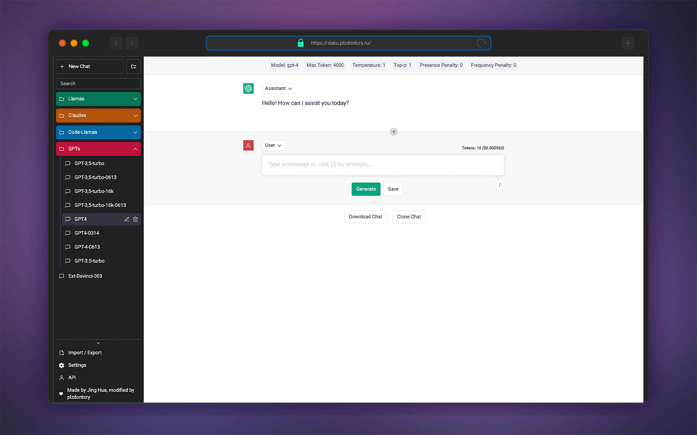

<h1 align="center"><b>DakuBetterChatGPT</b></h1>

<p align="center">
    <a href="https://daku.plzdontcry.ru" target="_blank"></a>
</p>

<h4 align="center"><b>BetterGPT modification for DakuWorks API Gateway Library</b></h4>

<div align="center">

[](https://hub.docker.com/r/plzdontcry/dakubettergpt/)
[](https://hub.docker.com/r/plzdontcry/dakubettergpt/)


[](https://hub.docker.com/r/plzdontcry/dakubettergpt/)

</div>

<div align="center">


</div>

<p align="center">
   You can host it by yourself of use a running instance: 
   
</p>
 <h3 align="center"><a href="https://bettergpt.chat">[ Enter Website ]</a></h3>
<br>

<div align="center">

[](https://huggingface.co/spaces/plzdontcry/dakubettergpt)
[](https://huggingface.co/spaces/plzdontcry/dakubettergpt?duplicate=true)


</div>
<p align="center"><i>If you enjoyed using it, please leave a star! 🌟</i></p>
<br>


## 🔮 DakuBetterChatGPT

<p align="center">
    <a href="https://daku.plzdontcry.ru" target="_blank">
        
    </a>
</p>

This project features a convinient WebUI based on Better ChatGPT interface with imported routes & models from **DakuWorks** chat completion models.

Some of the models may not work due fast DakuWorks project growing & modifiying, so feel free to notify me via issues if some models stopped working or yet not presented here.

# 🔥 Features

Still 'cause this this project's based on BetterChatGPT, the main features are:

- Proxy to bypass ChatGPT regional restrictions
- Prompt library
- Organize chats into folders (with colours)
- Filter chats and folders
- Token count and pricing
- Custom model parameters (e.g. presence_penalty)
- Chat as user / assistant / system
- Edit, reorder and insert any messages, anywhere
- Chat title generator
- Save chat automatically to local storage
- Import / Export chat
- Download chat (markdown / image / json)
- Multiple language support (i18n)

`+` UI simplified, some features removed (such as GDrive sync)

`+` Many AntiGPT-like prompts are imported as default in *Prompt Library*


# 🛠️ Usage

## ☁ Use running instance

To get started, simply visit working web instance at <https://daku.plzdontcry.ru>. Enter into the API menu your DakuWorks API Key obtained from [Their official Discord Server](https://discord.gg/7xkscNK7) (enter `#chat-twitter` channel and use `/token` command, following the provided instructions)

You can also access a running instance via HuggingFace using button below:

<div align="center">

[](https://huggingface.co/spaces/plzdontcry/dakubettergpt)

</div>

---

## 🐳  Host your own Instance using Docker

You can run standalone container:
```
docker run -detach -p 3000:3000 plzdontcry/dakubettergpt:latest
```
So the instance would be accesable on the `localhost:3000/` adress or on IP adress if it was properly set up

Running same container using Docker Compose:
```
version: "3.10"

services:
  dakubettergpt:
    container_name: dakubettergpt
    hostname: dakubettergpt
    image: plzdontcry/dakubettergpt:latest
    ports:
      - "3000:3000"
```

> There are also Docker Compose configuration available in the [`./docker-compose `subdirectory](https://github.com/nnagibator228/DakuBetterChatGPT/tree/main/docker-compose) with Traefik2 as reverse proxy

---

## 🤗 Run your own instance using HuggingFace

Create a HuggingFace account (if you don't have one already) and use button below:

<div align="center">

[](https://huggingface.co/spaces/plzdontcry/dakubettergpt?duplicate=true)

</div>

---

## 📑 Deploying to GitHub Pages

### Steps

1. Create a GitHub account (if you don't have one already)
1. Fork this [repository](https://github.com/nnagibator228/DakuBetterChatGPT)
1. In your forked repository, navigate to the `Settings` tab
   
1. In the left sidebar, click on `Pages` and in the right section, select `GitHub Actions` for `source`.
   
1. Now, click on `Actions`
   
1. In the left sidebar, click on `Deploy to GitHub Pages`
   
1. Above the list of workflow runs, select `Run workflow`.
   
1. Navigate back to the `Settings` tab
   
1. In the left sidebar, click on `Pages` and in the right section. Then at the top section, you can see that "Your site is live at `XXX`".
   

---

## 🖥️ Running it locally

1. Ensure that you have the following installed:

   - [node.js](https://nodejs.org/en/)
   - [yarn](https://yarnpkg.com/) or [npm](https://www.npmjs.com/)

2. Clone this [repository](https://github.com/ztjhz/BetterChatGPT) by running `git clone https://github.com/nnagibator228/DakuBetterChatGPT`
3. Navigate into the directory by running `cd DakuBetterChatGPT`
4. Run `yarn` or `npm install`, depending on whether you have yarn or npm installed.
5. Launch the app by running `yarn dev` or `npm run dev`

---

### Also check repo for UI CloudFlare Pages hosting [*>>> here*](https://github.com/nnagibator228/DakuBetterChatGPT-Host)

★ If you liked this project, don't forget to leave a star here! ★

<br>

[](https://huggingface.co)

---
